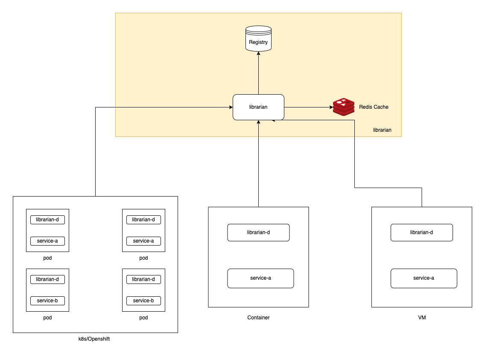

# Librarian

A service registry which helps keep track of all active instances running for
a particular service within a microservice architecture, and discover when a clients
needs it.

The application is built using go, and uses protobuf over REST specification to
talk to differnt clients.

### How it works

Librarian is a server which stores the information of all active instances for a service
registered with it. When a service starts up, the `librarian-d` which runs as sidecar
with the main application, helps register the instance with librarian.

Once the data is persisted, librarian becomes the central registry for discovering all
services within the microservice architecture.

### What is Service Registry and Discovery

Service Registry is a pattern, which according to me is not a very new design pattern
and specific to microservice, there were solution where in enterprises we have all service
definitions registered in a central location, which can easily help for other services to
discover where the former is running (for data-exchange).

But I became more close this to when working in microservice architecture. With modern
dynamic deployment systems, we can have 3 instances of service A running for scaling up.
When service B wants to talk to service A, it reachs out to the central registry to figure
out the addresses on which service A is running. This part where service B discovers where
instances of service A is/are running is called - Service Discovery.

The concept where all services, service A/B/etc all register themselves with the central
registry is called Service Registry.

A good example is [Netflix Eureka](https://github.com/Netflix/eureka/blob/master/README.md)

### Scope of Project

This is an **educational and experiemental project**, and obviously not and probably never
gonna be a production application. Maybe not even for dev applications, unless working
on a fun side project, just like this itself.

`librarian` is a registry server which is build using golang and currently runs
a single node with no resiliency. It works on the principle of [Client-Side Discovery](https://microservices.io/patterns/client-side-discovery.html)
and [3rd Party registration](https://microservices.io/patterns/3rd-party-registration.html) (for now).

For persistence we might be using a nosql database and mostly something which supports json
docs (mongo) and redis for caching.

### Good reads !

1. https://microservices.io/patterns/service-registry.html
1. https://microservices.io/patterns/self-registration.html
1. https://microservices.io/patterns/3rd-party-registration.html
1. https://microservices.io/patterns/server-side-discovery.html
1. https://microservices.io/patterns/client-side-discovery.html

### LICENSE

Even if not a production grade project, everything should be Licensed as told my experts
and my opinion !

This is [MIT LICENSE](LICENSE)d

### Diagrams

