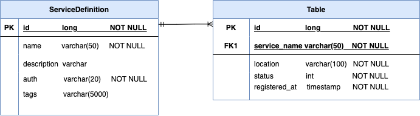

Structure of a Service definition:

**<u>ServiceDefinition</u>:**

| <u>Attribute</u> | <u>Description</u>                                   | <u>Required<u> |
| ---------------- | ---------------------------------------------------- | -------------- |
| name             | name of the service                                  | Yes            |
| location         | base location of the service                         | Yes            |
| _description_    | description of the service                           | Optional       |
| _auth_           | authentication for this service (defualt is NO auth) | Optional       |
| _tags_           | tags for the application                             | Optional       |

**<u>Request json</u>:**

_This is just a repr, as communications will be in form of protobuf_

### Registration Request Model:

```json
{
  "serviceDefinition": {
    "name": "service-a",
    "location": "127.0.0.1:8081",
    "auth": "basic",
    "description": "test service",
    "tags": "tag1, tag2, tag3"
  }
}
```

### Degistration:

- App died

```json
{
  "serviceName": "service-a",
  "location": "127.0.0.1:8081",
  "status": "dead"
}
```

- Health down

```json
{
  "serviceName": "service-a",
  "location": "127.0.0.1:8081",
  "status": "sick"
}
```

### Discovery

- Request Model:

```json
{
  "serviceName": "service-a"
}
```

- Response Model:

```json
{
  "serviceDefinition": {
    "name": "service-a",
    "locations": [
      "127.0.0.1:8081",
      "127.0.0.1:8082",
      "127.0.0.1:8083",
      "127.0.0.1:8084",
      "127.0.0.1:8085"
    ],
    "auth": "BASIC"
  }
}
```

### ERD


